<h1 align="center">
    
</h1>

## SpotCode
SpotCode is an app clone of Spotify made during the weekcode of OneBitCode with Ruby and ReactJS for its back-end and front-end, respectively. In this application, it's possible to search and see artists, albums and their music.

## Technologies
In this project the following technologies were used:
* Ruby version  2.7.1;
* Rails version 6.0.2.2;
* SQLite3.

## Ruby Gems
* Devise;
* Bootstrap;
* JQuery-rails;
* Serviceworker Rails.

## Getting started
* Dependency
  - Ruby  
  - Rails

* To create and build your database accord of the project.
  - rake db:create db:migrate
  
* To create the previous files to use on the project, on the database.
  - rake db:seed
  
* To install the gems.
  - bundle install
  
* To run the project.
  - rails s

## Screens

### 1 - Initial page

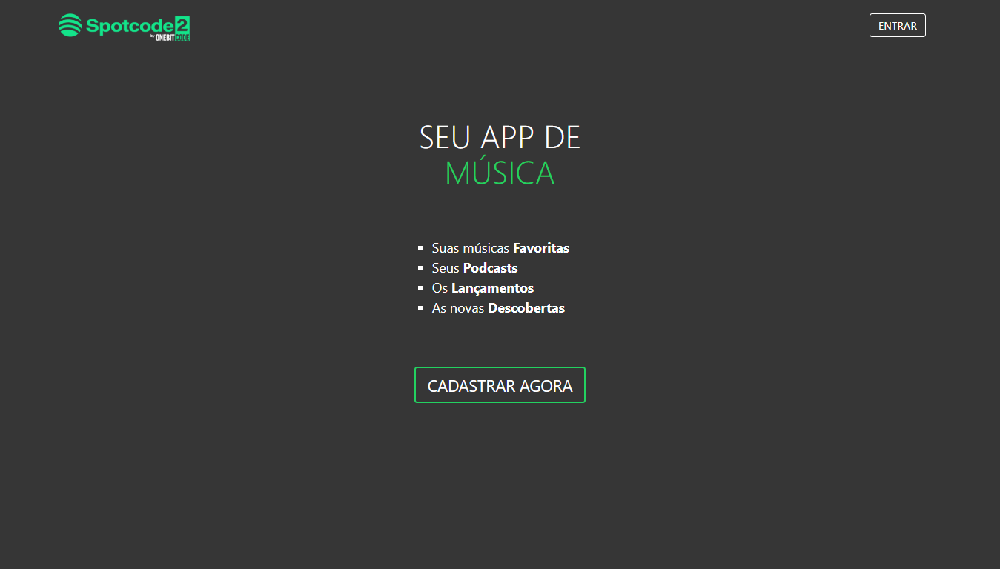

### 2 - Dashboard acessed after login

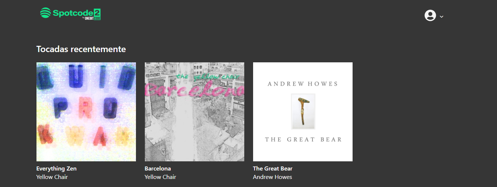
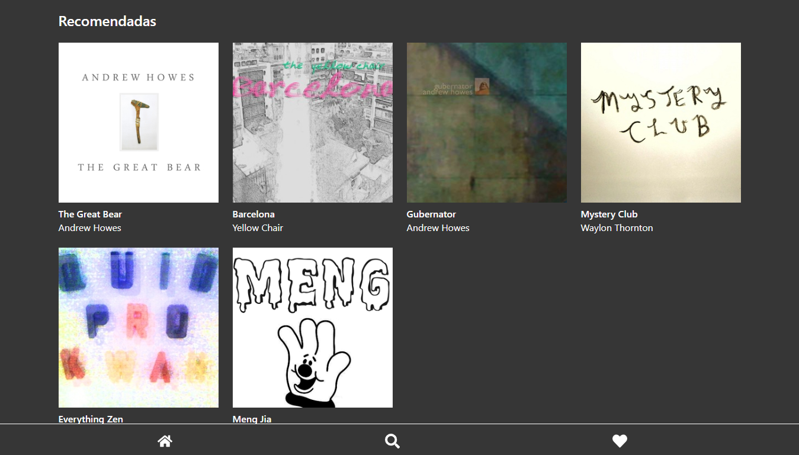

### 3 - Album details after clicking above it

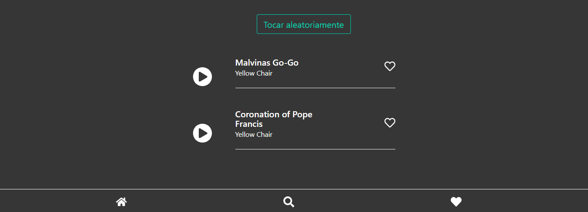

### 4 - Search screen where it's possible to search music, artists and albums accord of its category

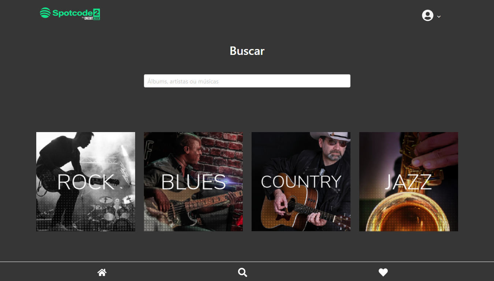

### 5 - Clicking on the category, will return:

  #### 5.1 - It's albums registered

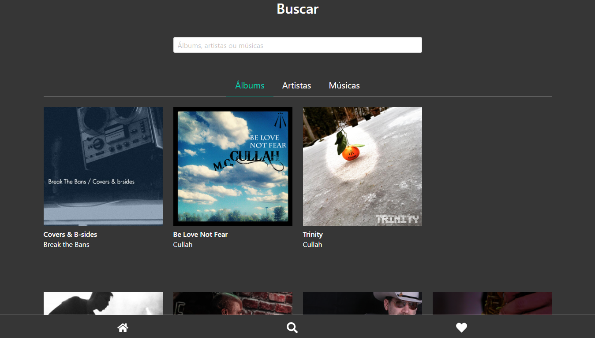

  #### 5.2 - It's artists

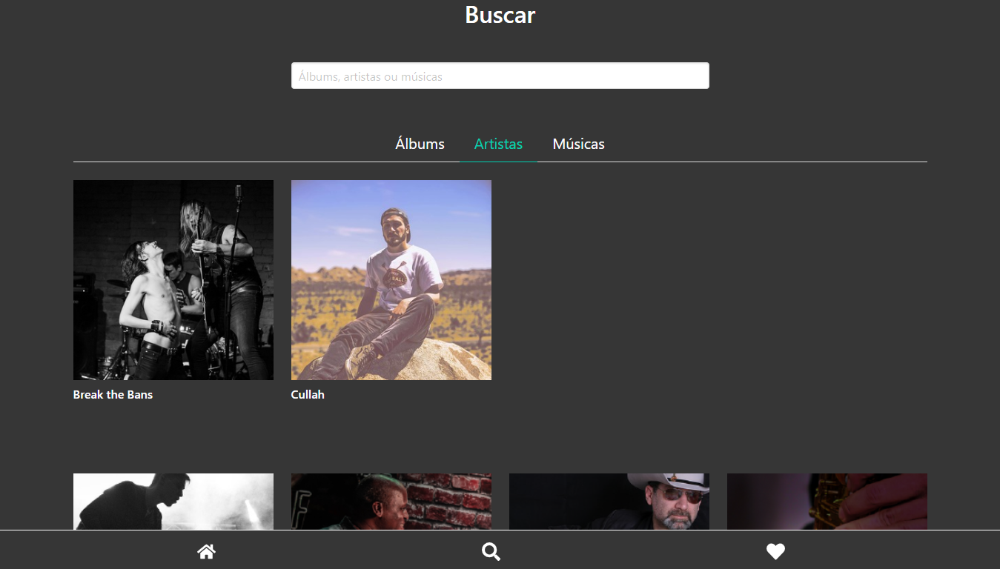

  #### 5.3 - It's musics

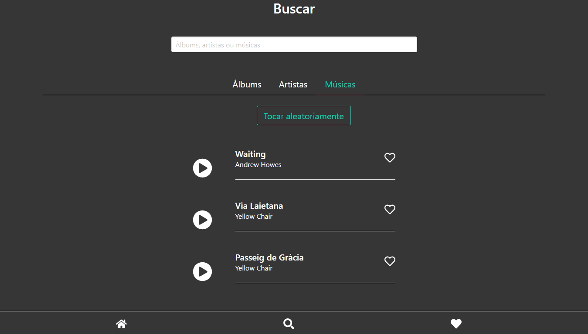

### 6 - Artist details after clicking above it

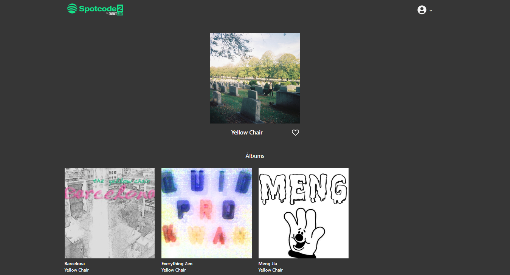

### 7 - Favorites screen where it's possible to see:
  #### 7.1 - The Favorite Albums.
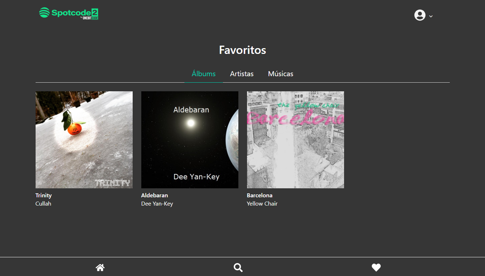

  #### 7.2 - The Favorite Artists.
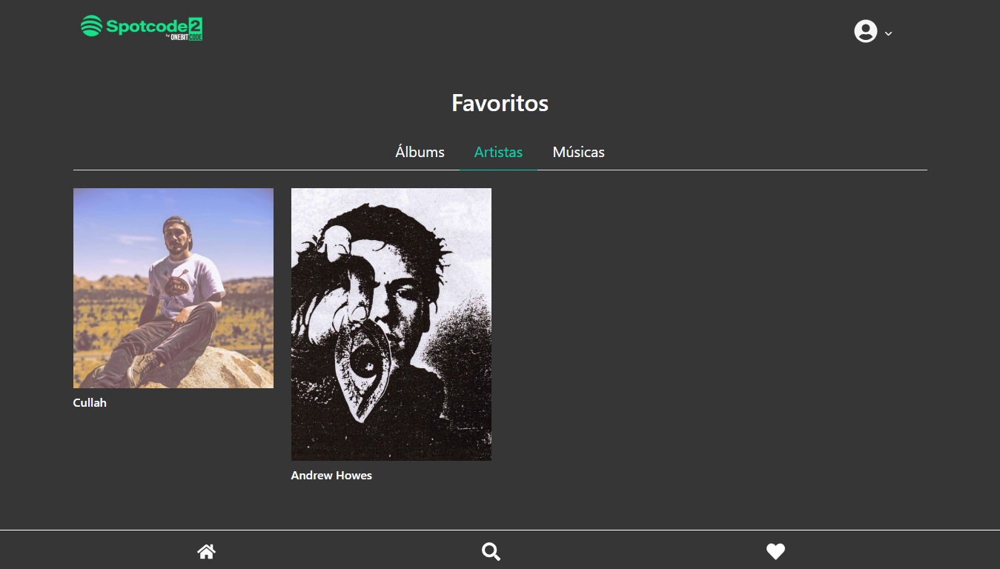

  #### 7.3 - The Favorite Musics.
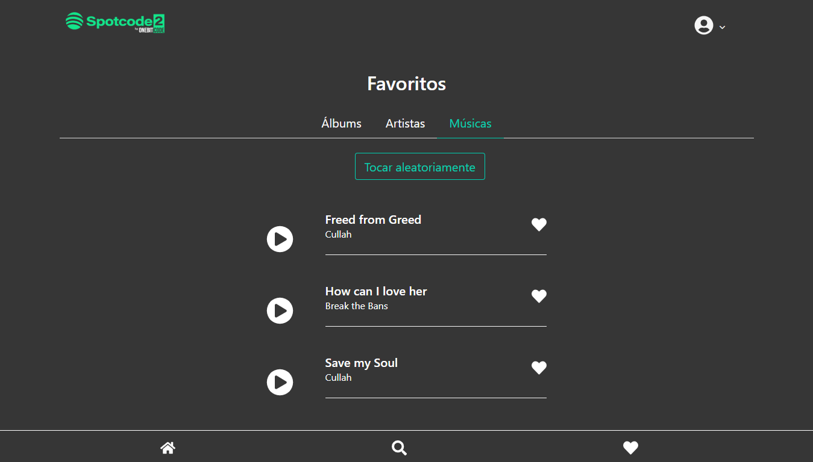

## Features
The main features of the application are:
* Listen Songs;
* Favorite Albums;
* Favorite Artists;
* Favorite Musics;
* See Album's details;
* See Artist's details;
* Search albums, musics and artists.

 ## Version
 1.0.0.0

 ## Authors
  * **Lucas Diniz** 

 Thanks for the visit!
